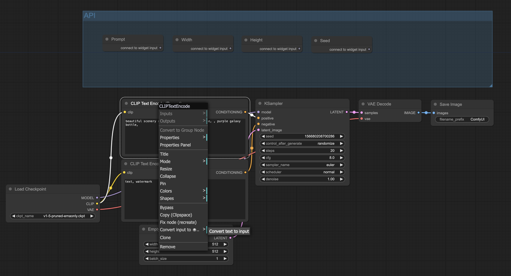

# Simple API

Comfycli can utilize a Simple API for defining exact parameters that a workflow is expected to work with.  While some extremely intricate workflows can have hundreds of parameters, only  small subset are in reality used.  By exposing a smaller subset of parameters that have a meaningful impact on the outcome of the pipeline, we can make a cleaner and more consice integration.

The Simple API is nothing more than a group with the title "API" that the input of node parameters.  To constrain the inention of the parameters, Comfycli only takes the first property of a node in the API group.  For example, you CAN add a KSampler to the API group, but only the parameter of the KSampler node will be exposed in the API.  The expected way to handle this is to convert each parameter of a node you want exposed in the API, create and add a Primitive node to the API group, and set the title of the Primitive node to the name of parameter that you want to be in the API.

The API group can also contain the output nodes that we are interested in retrieving output data from.

As an example, we'll take the default ComfyUI workflow and expose these parameters as an API:
* Prompt
* Width
* Height
* Seed

### Load the default workflow


### Add a Group and set the Title to "API"


### Add four primitive nodes to the API group


### Set the titles to "Prompt", "Width", "Height", and "Seed"


### Right click on each node that has a parameter we want to expose and select "Convert input to.." to convert the parameter to an input


### Connect each new input to the correct Primitive node in the API group


### Add a Preview Image node to the API group


### Set the title or the Preview Image node to OutputImage, remove the Save Image node, and save the workflow to default_with_api.json


### We can now work with the workflow via the Simple API
```bash
## Output the API in the workflow to the terminal
:~$ comfycli workflow api default_with_api.json

{
    "Height": {
        "Default": 0,
        "Min": 16,
        "Max": 16384,
        "Step": 8
    },
    "Prompt": {
        "Default": "",
        "Multiline": true
    },
    "Seed": {
        "Default": 0,
        "Min": 0,
        "Max": 9223372036854775807,
        "Step": 0
    },
    "Width": {
        "Default": 0,
        "Min": 16,
        "Max": 16384,
        "Step": 8
    }
}
```

```bash
## Output the current values of the API to the terminal
:~$ comfycli workflow api default_with_api.json --values

{
    "Height": 512,
    "Prompt": "beautiful scenery nature glass bottle landscape, , purple galaxy bottle,",
    "Seed": 156680208700286,
    "Width": 512
}
```

```bash
## Output the current values of the API and set the Prompt to "a frog in a coffee cup"
:~$ comfycli workflow api default_with_api.json --values Prompt="a frog in a coffee cup"

{
    "Height": 512,
    "Prompt": "a frog in a coffee cup",
    "Seed": 156680208700286,
    "Width": 512
}
```